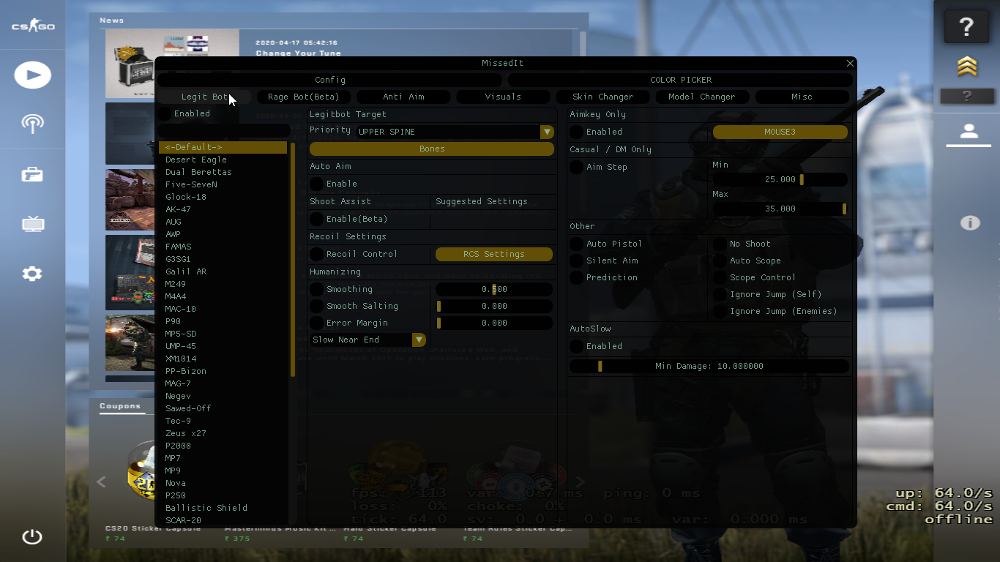
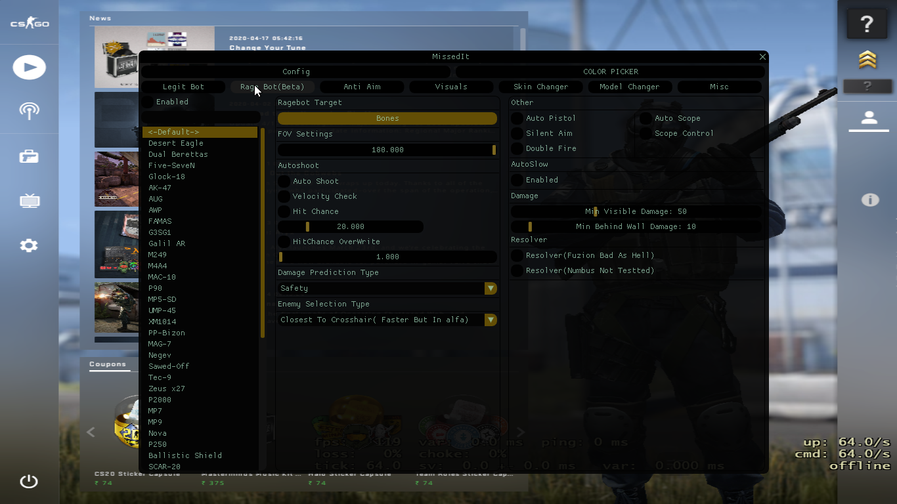

**Warning** this fork will probably contain a lot of pasted, shitty code.
===================
<p align="center">

</p>
===================

# MissedIT
<b> This branch is quite brocken now I want to try test branch untill I commit that code to master thanks :)</b>
* To get Stable Updates with Bug Fixes Use Master Branch<a href = https://github.com/HackerPolice/MissedIT >MissedIT</a>. 

# It looks like we are starting to get detected. Use public forks at your own Risk! 

Want to chat or play with other MissedIT users? Join us on Discord :- <a href = https://discord.gg/PDtg8hd><b>Hacker.Police Discord</b></a>


## What is MissedIT?

A fully featured internal hack for *CounterStrike : Global Offensive* written in C++. Which is a Fork of <a href = ""><b>Aimtux-Fuzion</b></a>

## AUR Installation
* Load MissedIT by using the command `./load`
* Unload using `./unload`

## Compiling

**Note:** _Do NOT download or compile as the root user._

#### Download the dependencies required to build MissedIT:

If you are having problems compiling make sure you've got the latest version of `g++`.

==================

__Ubuntu-Based / Debian:__
```bash
sudo apt install cmake g++ gdb git libsdl2-dev zlib1g-dev patchelf
```
__Arch:__
```bash
sudo pacman -S base-devel cmake gdb git sdl2 patchelf
```
__Fedora:__
```bash
sudo dnf install cmake gcc-c++ gdb git libstdc++-static mesa-libGL-devel SDL2-devel zlib-devel libX11-devel patchelf
```

===================

#### Download MissedIT:

```bash
git clone --recursive https://github.com/HackerPolice/MissedIT.git
```

```bash
cd MissedIT
```

===================

#### Compile with build script

You can build easily with the included build script.
```bash
./build
```

You can later update with 
```bash
./update
```


## Injecting using the load script

First of all, make sure CS:GO is open, and you are not in any official valve server. However, it is not recommended to inject while CS:GO is loading into a map. 

Navigate to the directory where MissedIT was built if you have not ready.
```bash
cd MissedIT
```

Now, you can inject the hack with the `load` script
```bash
./load
```

You might be prompted to enter in your password, this is because the injection script requires root access.

The text printed out during injection is not important. 

If the injection was successful you will see a message at the bottom saying `Successfully injected!`, however, if the message says `Injection failed`, then you've most likely done something wrong.

Now, go back into CS:GO, if you are in the main menu of the game you should see a banner in the top left like so:


*Note:* if you are getting crashes ( that are unrelated to game updates ) Try disabling shader precaching in your Steam Client -> Steam -> Settings -> Shader Pre-Caching. 

## Using the hack

Now that MissedIT has been injected into the game, press <kbd>Insert</kbd> on your keyboard to open the hack menu (<kbd>ALT</kbd>+<kbd>I</kbd> if you are using a laptop).

If you want to change skins, create and load configs or open the player list, you can find those buttons at the top of the screen.


## Unloading the hack

If you wish to unload the hack from the game, you can do so by entering the command:
```bash
./uload
```

## Configs

Configs are stored in a hidden directory in your home folder. Specifically 
```
~/.config/MissedIT/CSGO
```

Each `config.json` is stored in a seperately named folder (The name you see in-game, in the config window). 

To add a config, create a folder inside of the `~/.config/MissedIT/CSGO` folder with a name of your choice, and paste the `config.json` inside of that folder.

To see hidden folders inside your home folder, press <kbd>CTRL</kbd>+<kbd>H</kbd> when using a file manager.

On your command line, you can also add the -a flag on `ls` e.g.
```bash
ls -la ~/
```


## Grenade Configs

```
~/.config/MissedIT-GH/CSGO
```

Each `config.json` is stored in the folder named after them map name.

To add a config, copy the folder containing it to `~/.config/MissedIT/CSGO`


## Screenshots





## Credits

Special thanks to the Original AimTux project: [https://github.com/AimTuxOfficial/AimTux](https://github.com/AimTuxOfficial/AimTux).

Special thanks to the Fuzion For Panaroma Update And For Good Quality Codes: [https://github.com/LWSS/Fuzion](https://github.com/LWSS/Fuzion).

Special thanks to the Nimbus project For The UI and Resolver: [https://github.com/NimbusProjects/Nimbus](https://github.com/NimbusProjects/Nimbus)

Special thanks to [@aixxe](http://www.github.com/aixxe/) ([aixxe.net](http://www.aixxe.net)) for the skin changer and with the initial project, as well as helping this project with source code (Available on [@aixxe's](http://www.github.com/aixxe/) github page.).

This project was also originally based upon Atex's [Linux Basehook](http://unknowncheats.me/forum/counterstrike-global-offensive/181878-linux-basehook.html).

[telans](https://github.com/telans) for the AUR package
